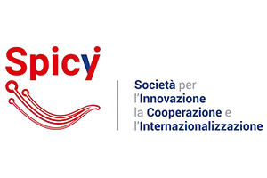

## About this profile

This repository serves as a curated portfolio of my work across applied machine learning, LLM based systems, and data driven experimentation.

The projects highlighted below represent a mix of academic research, competitive modeling, and enterprise system development, with a strong focus on reproducibility, system design, and real world constraints.

---

## Core focus
- Applied Machine Learning and Predictive Modeling
- LLM applications, RAG pipelines, and AI assistants
- Data engineering and analytics workflows
- Experimental research translated into usable systems

---

## Highlights

 

<a href="https://github.com/AlviRownok/SAbot-an-LLM-RAG-Assistant"><b>SAbot</b></a>

&nbsp;&nbsp;•&nbsp;&nbsp;
<a href="https://github.com/AlviRownok/BGPredictor"><b>BGPredictor</b></a>

&nbsp;&nbsp;•&nbsp;&nbsp;
<a href="https://github.com/AlviRownok/Grassberger_Procaccia"><b>Grassberger–Procaccia</b></a>

&nbsp;&nbsp;•&nbsp;&nbsp;
<a href="https://github.com/MicheleDelliVeneri/ALMASim"><b>ALMASim</b></a>

---

## Projects completed at Spici srl

The following systems were fully designed and implemented during my role as **Data Scientist at Spici srl**.  
These projects reached functional completion but were not released to production due to business or organizational constraints.

  

<a href="https://github.com/AlviRownok/OneDrive-Depth-Analytics"><b>OneDrive Depth Analytics</b></a>
&nbsp;&nbsp;•&nbsp;&nbsp;
<a href="https://github.com/AlviRownok/NAPOLI-GIS"><b>NAPOLI GIS</b></a>
&nbsp;&nbsp;•&nbsp;&nbsp;
<a href="https://github.com/AlviRownok/arcgis-map-app"><b>ArcGIS Map App</b></a>

**Notes:**
- The **ArcGIS Map App** is currently **non functional**, as the backend database previously hosted on **AWS** has been removed.
- System design, data modeling, and application logic were fully completed during development.

**Work scope included:**
- End to end system design and data pipelines  
- Analytical and geospatial modeling  
- Dashboard and visualization layers  
- Prototyping for enterprise and public sector use cases

---

## Tech stack
Python, Jupyter, Streamlit, classical machine learning, LLM tooling, data pipelines, geospatial frameworks, and cloud based experimentation.

---

## Connect
- LinkedIn: https://www.linkedin.com/in/alvi-rownok
- Instagram: https://www.instagram.com/aonindo

If you are interested in collaboration, research, or applied AI work, feel free to reach out.
