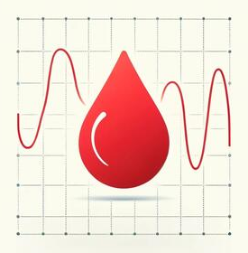

# Alvi Rownok

Software & AI Specialist focused on building practical, production oriented machine learning and LLM based systems.

I work across applied ML, data driven products, and intelligent automation, with strong attention to structure, reproducibility, and real world constraints.

---

## Core focus
- Applied Machine Learning and Predictive Modeling
- LLM applications, RAG pipelines, and AI assistants
- Data engineering and analytics workflows
- Experimental research translated into usable systems

---

## Highlights

  

    <a href="https://github.com/AlviRownok/SAbot-an-LLM-RAG-Assistant" style="text-decoration:none;">
      

        
        

          

            <b>SAbot</b>
            
          

          

            LLM RAG assistant with structured retrieval
          

        

      

    </a>

    <a href="https://github.com/AlviRownok/BGPredictor" style="text-decoration:none;">
      

        
        

          

            <b>BGPredictor</b>
            
          

          

            Kaggle ensemble based glucose prediction
          

        

      

    </a>

    <a href="https://github.com/AlviRownok/Grassberger_Procaccia" style="text-decoration:none;">
      

        
        

          

            <b>Grassberger</b>
            
          

          

            Correlation dimension in nonlinear systems
          

        

      

    </a>

  

---

## Tech stack
Python, Jupyter, Streamlit, classical machine learning, LLM tooling, data pipelines, and cloud based experimentation.

---

## Connect
- LinkedIn: https://www.linkedin.com/in/alvi-rownok
- Instagram: https://www.instagram.com/aonindo

If you are interested in collaboration, research, or applied AI work, feel free to reach out.
